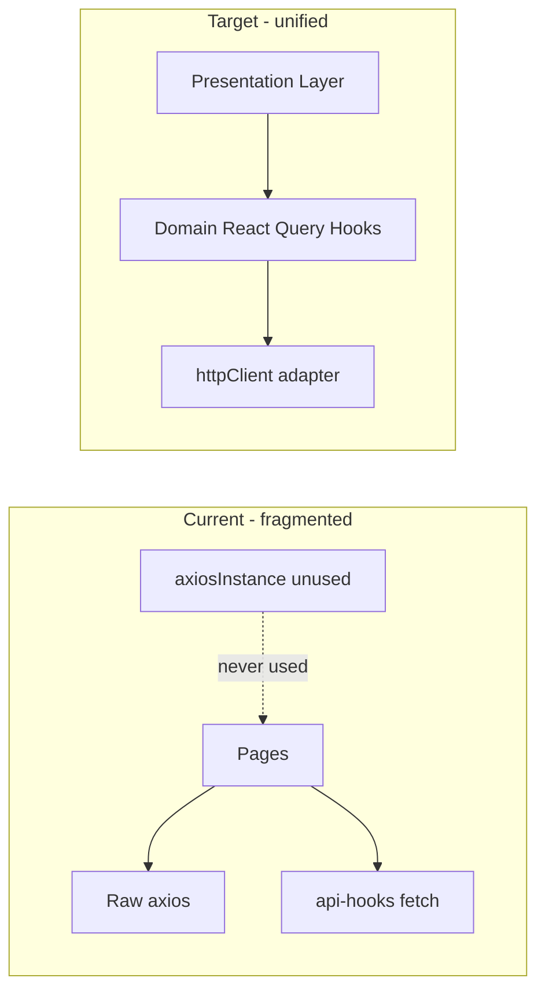
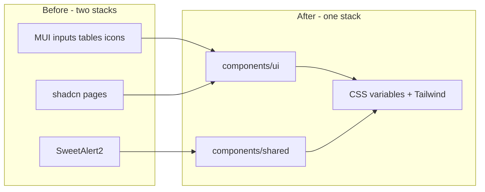
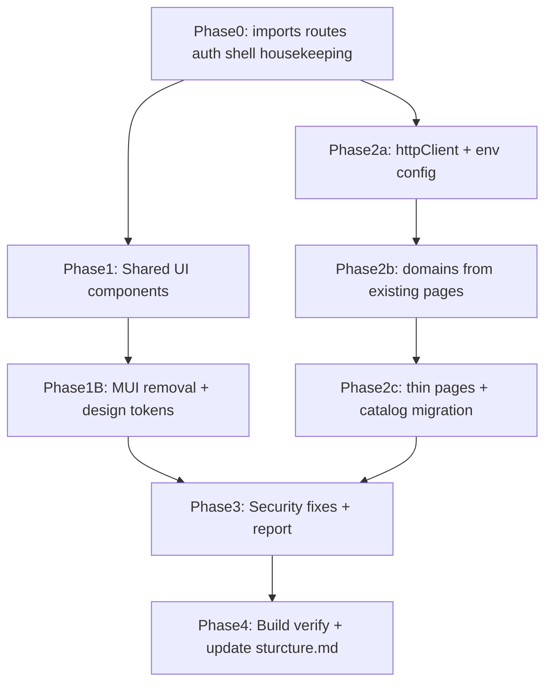
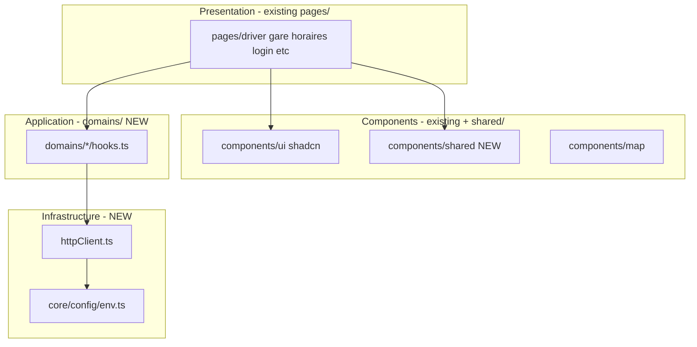

# KWIM App: UI, Architecture, and Security Modernization

> Grounded in verified file tree: [`sturcture.md`](sturcture.md) (snapshot 6/18/2026)

## Verified Existing Structure

The repo has **no `src/component/` folder** (legacy singular path). Broken imports must target files that already exist or new files we add under existing folders.

### Reuse (already in tree — do not recreate)

| Need | Existing file |
|------|---------------|
| Data table header | [`src/components/data-table/CardDataTable.tsx`](src/components/data-table/CardDataTable.tsx) |
| TanStack data table | [`src/components/map/ReusableDataTable.tsx`](src/components/map/ReusableDataTable.tsx) |
| Map styling | [`src/components/map/MapStyles.tsx`](src/components/map/MapStyles.tsx) |
| Error / page chrome | [`src/components/utilities/ErrorBanner.tsx`](src/components/utilities/ErrorBanner.tsx), [`PageTitle.tsx`](src/components/utilities/PageTitle.tsx) |
| Loading skeletons | [`src/components/SkeletonCard.tsx`](src/components/SkeletonCard.tsx), [`src/components/ui/skeleton.tsx`](src/components/ui/skeleton.tsx) |
| Toast system | [`src/components/ui/toaster.jsx`](src/components/ui/toaster.jsx) + [`src/hooks/use-toast.ts`](src/hooks/use-toast.ts) — mount only |
| shadcn primitives | 25 files under [`src/components/ui/`](src/components/ui/) |
| Auth store | [`src/store/useUserStore.tsx`](src/store/useUserStore.tsx) |
| Redux breadcrumbs | [`src/store/reducers/appReducer.tsx`](src/store/reducers/appReducer.tsx) |
| i18n | [`src/locales/en.json`](src/locales/en.json), [`fr.json`](src/locales/fr.json) |
| Settings mock | [`src/lib/data/db.json`](src/lib/data/db.json) |

### Create (confirmed missing from tree)

| New path | Consumed by |
|----------|-------------|
| `src/components/shared/LoadingState.tsx` | `pages/driver/Driver.tsx`, `pages/gare/Gare.tsx` |
| `src/components/shared/SearchBar.tsx` | Driver, Gare |
| `src/components/shared/DialogSteps.tsx` | AddDriver, AddGare, EditDriver, EditStation |
| `src/components/shared/EmptyState.tsx`, `ErrorState.tsx`, `FeatureTabShell.tsx` | customer, inventory, Administration, UserManagement |
| `src/components/map/MapPicker.tsx` | AddGare, EditStation |
| `src/components/map/MapHoraire.tsx`, `MapDetailStation.tsx` | Horaire, GareMap |
| `src/components/shared/ReusableSelect.tsx`, `HoraireComponent.tsx` | Horaire |
| `src/routes/ProtectedRoute.tsx` | all protected routes |
| `src/infrastructure/http/httpClient.ts` | replaces root [`axiosInstance.tsx`](src/axiosInstance.tsx) |
| `src/domains/{identity,fleet,network,scheduling,catalog}/` | clean-arch modules |
| `src/core/config/env.ts` | replaces root [`config.tsx`](config.tsx) |

### Route-to-page inventory

| Route module | Page(s) | Wired? |
|--------------|---------|--------|
| `/` inline | [`pages/dashbord/DashboardPage.tsx`](src/pages/dashbord/DashboardPage.tsx) | Yes |
| `inventoryRoute.tsx` | [`pages/inventory/Inventory.tsx`](src/pages/inventory/Inventory.tsx) | Yes (broken casing) |
| `customerRoutes.tsx` | [`pages/customer/index.tsx`](src/pages/customer/index.tsx) | Yes |
| `settingsRoutes.tsx` | [`pages/settings/`](src/pages/settings/) (5 files) | Yes |
| `userRoutes.tsx` | [`pages/user-management/UserManagement.tsx`](src/pages/user-management/UserManagement.tsx) | Yes |
| `administratorRoute.tsx` | Administration + GareMap | **No** |
| `horaireRoutes.tsx` | Horaire | **No** |
| `changePasswordRoute.tsx` | UpdatePassword | **No** |
| `dashbordRoutes.tsx` | duplicate `/dashboard` | Orphan |
| `oraganizationRoute.tsx` | organization.tsx | Commented out |
| `/login` inline | Login.tsx | Yes |
| — | Effacer.tsx (Login duplicate) | Delete |
| — | Payroll.tsx, organization.tsx | No route — wire or remove from sidebar |

### Page-to-domain mapping (DDD)

| Domain | Existing `pages/` paths | Key `components/` |
|--------|-------------------------|-------------------|
| identity | `login/*`, `user-management/*` (8 files) | EnhancedTable, OrderTable |
| fleet | `driver/*` (4 files) | CardDataTable, ReusableDataTable |
| network | `gare/*` (5 files), `administration/` | MapStyles, MapPicker (new) |
| scheduling | `horaires/*` (2 files) | MapHoraire (new) |
| catalog | `inventory/`, `customer/`, `dashbord/` | dashboard/*, api-hooks.ts |
| settings | `settings/*` (5 files) | useSettings.ts, db.json |
| orphan | `organization/`, `payroll/` | decide in Phase 0 |

### Phase 0 housekeeping (from file tree)

- Rename [`notificationDropdown .tsx`](src/components/topbar/notificationDropdown%20.tsx) → `notificationDropdown.tsx`
- Delete confirmed dead: [`hooks/useFetch.jsx`](src/hooks/useFetch.jsx), [`hooks/usePost.jsx`](src/hooks/usePost.jsx), [`lib/api.ts`](src/lib/api.ts)
- Consolidate: `form.jsx`/`form.tsx`, `use-toast.jsx`/`use-toast.ts`
- Replace stale [`src/types/index.d.ts`](src/types/index.d.ts) with KWIM types
- Regenerate [`sturcture.md`](sturcture.md) after implementation

---

## Current State

The app is a **frontend-only** Vite + React 18 SPA with two merged codebases:

- **Transit/IAM domain** (drivers, stations, schedules, login, user-mgmt) — raw `axios`, Formik, **MUI**, SweetAlert2, hardcoded hex colors
- **Template domain** (inventory, customers, dashboard widgets) — shadcn, React Query via [`src/lib/api-hooks.ts`](src/lib/api-hooks.ts)

**Design inconsistency today:** two visual stacks (MUI filled inputs + SweetAlert modals vs shadcn cards/tables/toasts), mixed icon libraries (`@mui/icons-material`, `lucide-react`, `react-bootstrap-icons`), and hardcoded colors (`#0F123F`, `#191c21`, `#FFFFFF`) outside the Tailwind CSS variable system in [`src/index.css`](src/index.css).

| Issue | Impact |
|-------|--------|
| 15+ imports from missing `src/component/` folder | Build/runtime failures on driver, gare, horaires pages |
| [`inventoryRoute.tsx`](src/routes/inventory/inventoryRoute.tsx) imports `inventory/inventory` but file is `Inventory.tsx` | Case-sensitive build failure |
| [`axiosInstance.tsx`](src/axiosInstance.tsx) unused; pages use raw axios without auth headers | API calls fail when backend requires JWT |
| No route guards; login wrapped in full `AppLayout` | Broken auth UX |
| `<Toaster />` never mounted | Toast notifications silently fail |
| Two `QueryClient` instances ([`main.tsx`](src/main.tsx) vs [`lib/queryClient.ts`](src/lib/queryClient.ts)) | Cache invalidation bugs |
| Hardcoded secrets in source ([`config.tsx`](config.tsx), Mapbox token in gare pages) | Security risk |
| [`administratorRoute.tsx`](src/routes/user/administratorRoute.tsx), horaire routes, `/update-password` not wired | Core features unreachable |
| **7 files still import `@mui/*`** | Inconsistent UI; extra bundle weight (~300KB) |
| **8 files use SweetAlert2** | Breaks visual and a11y consistency with shadcn |
| **Hardcoded hex colors** in sidebar, CardDataTable, user-mgmt, gare | Dark mode broken; off-brand look |



---

## Phase 0: Stabilize and Make It Run

**Goal:** `pnpm run dev` and `pnpm run build` succeed; all registered routes render without import errors.

### 0.1 Fix broken imports (map old paths to existing or new components)

| Missing import | Resolution |
|----------------|------------|
| `component/carddataTable/CardDataTable` | Point to [`src/components/data-table/CardDataTable.tsx`](src/components/data-table/CardDataTable.tsx) |
| `component/utilitie/ReusableDataTable` | Point to [`src/components/map/ReusableDataTable.tsx`](src/components/map/ReusableDataTable.tsx) |
| `component/utilitie/Loading` | Create [`src/components/shared/LoadingState.tsx`](src/components/shared/LoadingState.tsx) |
| `component/utilitie/SearchBar` | Create [`src/components/shared/SearchBar.tsx`](src/components/shared/SearchBar.tsx) |
| `component/utilitie/ReusableDialogSteps` / `ReusableDialogStepsEdit` | Create [`src/components/shared/DialogSteps.tsx`](src/components/shared/DialogSteps.tsx) (shadcn Dialog + step state) |
| `component/cartoTrip/MapComponent` | Create [`src/components/map/MapPicker.tsx`](src/components/map/MapPicker.tsx) using existing Mapbox deps |
| `component/utilitie/map/MapHoraire`, `MapDetailStation` | Create thin wrappers in `src/components/map/` |
| `component/utilitie/ReusableSelect`, `HoraireComponent` | Create minimal equivalents in `src/components/shared/` |
| `../../../@/components/ui/tooltip` in [`Driver.tsx`](src/pages/driver/Driver.tsx) | Fix to `@/components/ui/tooltip` |
| `@/pages/inventory/inventory` | Fix to `@/pages/inventory/Inventory` |

### 0.2 Wire all routes

Update [`src/routes/RoutesProvider.tsx`](src/routes/RoutesProvider.tsx) to register:

- [`administratorRoute.tsx`](src/routes/user/administratorRoute.tsx) — `/administration`, `/administration/map-detail`
- [`horaireRoutes.tsx`](src/routes/horaire/horaireRoutes.tsx) — fix `PageTitle` import path
- [`changePasswordRoute.tsx`](src/routes/settings/changePasswordRoute.tsx) — `/update-password`

Align [`src/components/sidebar/index.tsx`](src/components/sidebar/index.tsx): remove or stub dead links (`/orders`, `/products`, etc.) to match actual routes.

### 0.3 App shell fixes

- [`AppLayout.tsx`](src/components/layouts/AppLayout.tsx): hide Sidebar/Topbar on `/login`, `/update-password`
- Mount `<Toaster />` in [`App.tsx`](src/App.tsx) or [`main.tsx`](src/main.tsx)
- Add [`src/routes/ProtectedRoute.tsx`](src/routes/ProtectedRoute.tsx): redirect unauthenticated users to `/login`; wrap protected routes
- Implement logout in [`userDropdown.tsx`](src/components/topbar/userDropdown.tsx) (clear Zustand + localStorage, navigate to `/login`)

### 0.4 Unify React Query client

Use the configured client from [`src/lib/queryClient.ts`](src/lib/queryClient.ts) as the single provider in [`main.tsx`](src/main.tsx).

### 0.5 Housekeeping (from file tree audit)

See **Phase 0 housekeeping** section above. Run alongside 0.1–0.4.

---

## Phase 1: Shared UI Foundation (Prompt 1)

**Goal:** Production-grade reusable components; one design system (shadcn/Tailwind primary).

### 1.1 Shared state components

Create under `src/components/shared/`:

| Component | Purpose |
|-----------|---------|
| `LoadingState` | Spinner/skeleton with `aria-busy`, `role="status"` |
| `EmptyState` | Icon + title + optional action CTA |
| `ErrorState` | Error message + retry button, `role="alert"` |
| `PageHeader` | Title, description, actions slot (extends `PageTitle`) |
| `FeatureTabShell` | Extract from duplicated [`Administration.tsx`](src/pages/administration/Administration.tsx) / [`UserManagement.tsx`](src/pages/user-management/UserManagement.tsx) |

### 1.2 Consolidate feedback

- **Remove SweetAlert2 entirely** — replace with shadcn `useToast` (success/error) and `AlertDialog` (confirm delete)
- Replace inline `"Loading..."` / red `<p>` errors with shared state components in all pages

### 1.3 Accessibility pass (WCAG basics)

- Login form: link errors via `aria-describedby` / `aria-invalid` using shadcn `Input` + `Label`
- Sidebar: `aria-current="page"` on active nav item
- Theme toggle: `aria-expanded`, keyboard support
- `<main aria-label="Main content">` in AppLayout
- Remove `console.log` of tokens/user data in [`Login.tsx`](src/pages/login/Login.tsx), [`Driver.tsx`](src/pages/driver/Driver.tsx)

### 1.4 Remove duplicates

Delete unused `.jsx` twins once all consumers use `.tsx`: `form.jsx`, `use-toast.jsx` (keep one canonical file each).

---

## Phase 1B: Unified Design System — Remove MUI, One Visual Language

**Goal:** Every screen uses shadcn/ui + Tailwind CSS variables. Zero `@mui/*` imports. Same look on login, driver CRUD, user-mgmt, and inventory.

### 1B.1 Design system rules (single source of truth)

Extend [`src/index.css`](src/index.css) and [`tailwind.config.js`](tailwind.config.js):

| Token | Usage | Replace |
|-------|-------|---------|
| `bg-background`, `text-foreground` | Page backgrounds, body text | `#eff3f6`, `#191c21` |
| `bg-card`, `text-card-foreground` | Cards, panels | `bg-[#FFFFFF]`, `bg-[#ffffff]` |
| `bg-primary`, `text-primary-foreground` | Buttons, badges, sidebar accent | `bg-[#0F123F]` |
| `bg-muted`, `text-muted-foreground` | Secondary text, placeholders | `#191c21c8`, `#707eae` |
| `border-border` | All borders | ad-hoc `border-[#90959e96]` |
| `rounded-lg` / `--radius` | Consistent corner radius | mixed `rounded-xl`, `rounded-md` |
| `font-sans` (Roboto via existing `@font-face`) | All text | MUI default font stack |

Add optional brand tokens if needed:

```css
:root {
  --brand-navy: 247 47% 16%;   /* maps old #0F123F */
  --sidebar: 247 47% 16%;
  --sidebar-foreground: 0 0% 98%;
}
```

Create [`src/components/shared/ConfirmDialog.tsx`](src/components/shared/ConfirmDialog.tsx) — reusable delete-confirm wrapper around shadcn `AlertDialog` (replaces all `Swal.fire` confirm patterns).

### 1B.2 MUI → shadcn migration map (all 7 files)

| File | MUI today | shadcn replacement |
|------|-----------|-------------------|
| [`Login.tsx`](src/pages/login/Login.tsx) | `Button`, `FilledInput`, `FormControl`, `InputLabel` | `Button`, `Input`, `Label` + shadcn `Card` layout; delete [`login.css`](src/pages/login/login.css) MUI overrides |
| [`UpdatePassword.tsx`](src/pages/login/UpdatePassword.tsx) | same as Login | same pattern |
| [`Effacer.tsx`](src/pages/login/Effacer.tsx) | duplicate Login | **Delete file** (housekeeping) |
| [`EnhancedTable.tsx`](src/pages/user-management/EnhancedTable.tsx) | full MUI `Table`, `Checkbox`, `TablePagination`, `TableSortLabel` | Rewrite using shadcn [`Table`](src/components/ui/table.tsx) + [`Checkbox`](src/components/ui/checkbox.tsx) + [`Pagination`](src/components/ui/pagination.tsx); or consolidate into shared `DataTable` built on TanStack Table (same pattern as customer/inventory) |
| [`ReusableDataTable.tsx`](src/components/map/ReusableDataTable.tsx) | MUI `IconButton` | shadcn `Button` variant `ghost` size `icon` |
| [`CardDataTable.tsx`](src/components/data-table/CardDataTable.tsx) | `@mui/icons-material` SendSharp, UploadFileSharp | `lucide-react` `Send`, `Upload`; use `bg-card`, `text-muted-foreground` |
| [`Horaire.tsx`](src/pages/horaires/Horaire.tsx) | MUI `Skeleton` | shadcn [`Skeleton`](src/components/ui/skeleton.tsx) |

### 1B.3 SweetAlert2 → shadcn (8 files)

| File | Swal usage | Replacement |
|------|------------|-------------|
| `Driver.tsx`, `Gare.tsx` | delete success/error | `useToast` + `ConfirmDialog` |
| `AddDriver.tsx`, `EditDriver.tsx` | create/update feedback | `useToast` |
| `AddGare.tsx`, `EditStation.tsx` | create/update feedback | `useToast` |
| `Horaire.tsx`, `Groupe.tsx`, `User.tsx` | various alerts | `useToast` / `ConfirmDialog` |

After migration: `pnpm remove sweetalert2` and delete any `swal-custom` CSS.

### 1B.4 Form stack unification

| Area | Today | Target |
|------|-------|--------|
| Login, UpdatePassword | Formik + Yup + MUI | Formik + Yup + **shadcn Input/Label/Button** (Phase 1B); optional later migrate to react-hook-form + zod |
| Driver, Gare, Horaire wizards | Formik + Yup + custom dialogs | Formik + Yup + shadcn `DialogSteps` + shadcn form fields |
| Customer, Inventory, Settings | react-hook-form + zod + shadcn | **Keep as reference pattern** — all new/refactored forms follow this |

All form fields use: `Label` + `Input`/`Select`/`Checkbox` from `components/ui/`, error text with `text-destructive text-sm` and `aria-invalid`.

### 1B.5 Icon unification

| Library | Action |
|---------|--------|
| `@mui/icons-material` | **Remove** — replace with `lucide-react` |
| `lucide-react` | **Primary** icon set everywhere |
| `react-bootstrap-icons` | Migrate sidebar icons to lucide equivalents in [`sidebar/index.tsx`](src/components/sidebar/index.tsx) |
| `react-spinners` (PacmanLoader in ReusableDataTable) | Replace with shadcn `Skeleton` rows or `LoadingState` spinner |

### 1B.6 Hardcoded color cleanup

Replace hex literals with semantic classes in these files (grep-driven, complete sweep):

- [`components/sidebar/SidebarFooter.tsx`](src/components/sidebar/SidebarFooter.tsx) — `bg-sidebar` token
- [`components/data-table/CardDataTable.tsx`](src/components/data-table/CardDataTable.tsx)
- [`pages/user-management/User.tsx`](src/pages/user-management/User.tsx), [`Groupe.tsx`](src/pages/user-management/Groupe.tsx)
- [`pages/horaires/Horaire.tsx`](src/pages/horaires/Horaire.tsx)
- [`pages/administration/Administration.tsx`](src/pages/administration/Administration.tsx)
- [`pages/gare/GareMap.tsx`](src/pages/gare/GareMap.tsx)
- [`components/layouts/AppLayout.tsx`](src/components/layouts/AppLayout.tsx) — `bg-muted/50` instead of `bg-gray-50`

### 1B.7 Table unification

Converge three table implementations into one shared component:

| Current | Action |
|---------|--------|
| shadcn `Table` in customer/inventory | **Canonical pattern** |
| `ReusableDataTable` (TanStack + MUI icons) | Refactor to shadcn-only; move to `components/shared/DataTable.tsx` |
| `EnhancedTable` (full MUI) | Replace with shared `DataTable` |
| `OrderTable` in user-mgmt | Evaluate merge into shared `DataTable` or keep as thin wrapper |

### 1B.8 Package cleanup (after all migrations)

```bash
pnpm remove @mui/material @mui/icons-material @emotion/react @emotion/styled sweetalert2 react-spinners
```

Verify build and bundle size reduction.

### 1B.9 Visual consistency checklist (every page must pass)

- Uses only `components/ui/*` and `components/shared/*` for interactive elements
- No `@mui/*` imports
- No `Swal.fire` calls
- No hardcoded hex background/text colors (only Tailwind semantic tokens)
- Loading → `LoadingState` or `Skeleton`
- Empty → `EmptyState`
- Error → `ErrorState` or `ErrorBanner`
- Confirm destructive actions → `ConfirmDialog`
- Success/error feedback → `useToast`
- Works in **light and dark** mode via existing `useThemeStore`



---

## Phase 2: Clean Architecture Refactor (Prompt 2)

**Goal:** Separate concerns without changing API contracts or user-visible behavior.

### 2.1 Target folder structure (evolve in place)

**Keep** all existing folders from [`sturcture.md`](sturcture.md). **Add** new layers alongside them — no big-bang move of `pages/` or `components/`.

```
kwim-app/
├── config.tsx              → re-export from src/core/config/env.ts (compat)
├── src/
│   ├── assets/             # KEEP — fonts, logos, sidebar icons
│   ├── components/
│   │   ├── ui/             # KEEP — shadcn primitives (25 files)
│   │   ├── sidebar/        # KEEP — 6 files
│   │   ├── topbar/         # KEEP — fix notificationDropdown space
│   │   ├── layouts/        # KEEP — AppLayout
│   │   ├── map/            # KEEP + ADD MapPicker, MapHoraire, MapDetailStation
│   │   ├── data-table/     # KEEP — CardDataTable
│   │   ├── dashboard/      # KEEP — inventory-table, recent-activity
│   │   ├── utilities/      # KEEP — ErrorBanner, PageTitle
│   │   └── shared/         # NEW — LoadingState, EmptyState, ErrorState, FeatureTabShell
│   ├── pages/              # KEEP all 12 domain folders — thin wrappers after refactor
│   ├── routes/             # KEEP — wire orphan route modules
│   ├── store/              # KEEP — Redux + Zustand; auth stays in useUserStore
│   ├── hooks/              # KEEP cross-cutting only (useUserData, useSettings, use-toast)
│   ├── lib/                # KEEP utils, queryClient; migrate api-hooks → domains/catalog
│   ├── locales/            # KEEP
│   ├── types/              # REPLACE stale index.d.ts with domain types
│   ├── styles/             # KEEP materiel.css, shadcn.css
│   ├── core/               # NEW
│   │   └── config/env.ts, tenantContext.ts
│   ├── infrastructure/     # NEW
│   │   └── http/httpClient.ts, tokenStorage.ts
│   └── domains/            # NEW — bounded contexts
│       ├── identity/       # api.ts, hooks.ts, types.ts
│       ├── fleet/          # driver CRUD
│       ├── network/        # stations, maps
│       ├── scheduling/     # horaires
│       └── catalog/        # inventory, customers (from api-hooks.ts)
```

Root files [`axiosInstance.tsx`](src/axiosInstance.tsx) and [`config.tsx`](config.tsx) become thin re-exports pointing to `infrastructure/` and `core/` so existing imports keep working during migration.

### 2.2 Unified HTTP client

Replace [`axiosInstance.tsx`](src/axiosInstance.tsx) with [`src/infrastructure/http/httpClient.ts`](src/infrastructure/http/httpClient.ts):

- Read JWT from `localStorage.user.token` (matches login flow, not orphaned `access_token` keys)
- Attach `Authorization: Bearer <token>` on every request
- On 401: clear session, redirect to `/login`
- Export typed `get/post/put/patch/delete` helpers

Migrate pages incrementally: identity → fleet → network → scheduling. Pages become thin:

```tsx
// Before (Driver.tsx): inline fetchDrivers + axios
// After: const { data, isLoading, error } = useDrivers(search);
```

### 2.3 Environment config

- Add [`.env.example`](.env.example) with `VITE_API_BASE_URL`, `VITE_MAPBOX_TOKEN`
- Update [`config.tsx`](config.tsx) to use `import.meta.env.VITE_API_BASE_URL`
- Add `.env` to [`.gitignore`](.gitignore)
- Move Mapbox token from [`AddGare.tsx`](src/pages/gare/AddGare.tsx) / [`EditStation.tsx`](src/pages/gare/EditStation.tsx) to env

### 2.4 Tenant context

Extract hardcoded company IDs (`67cfe955595f541695c1b99b`, `67bc9002f682d26a7f7a9200`) into [`src/core/config/tenantContext.ts`](src/core/config/tenantContext.ts) read from connected user profile via [`useUserData`](src/hooks/useUserData.tsx) — same IDs as fallback to preserve behavior when profile lacks company.

### 2.5 State consolidation

- Auth: Zustand [`useUserStore`](src/store/useUserStore.tsx) only; remove duplicate hydration in App if store handles persist
- Breadcrumbs: keep Redux for now (no behavior change) or migrate to Zustand in a follow-up
- Fix [`PremiumFeature.tsx`](src/components/PremiumFeature.tsx) import/export mismatch

### 2.6 Template domain decision

Keep inventory/customer pages but route their API through the same `httpClient` pointing at `VITE_API_BASE_URL`. If `/api/products` endpoints don't exist on the 5050 backend, gate those pages behind a feature flag or show `EmptyState` with "API not configured" rather than silent fetch failures — preserves nav without breaking the shell.

---

## Phase 3: Security Hardening (Prompt 3)

**Goal:** Mitigate critical/high findings and deliver audit documentation.

### 3.1 Critical/High mitigations (code changes)

| Finding | Severity | Fix |
|---------|----------|-----|
| JWT in localStorage (XSS risk) | High | Document risk; add CSP meta via Vite plugin config; plan httpOnly cookie migration as backend follow-up |
| Auth header not sent on API calls | High | Phase 2 httpClient |
| No route protection | High | Phase 0 ProtectedRoute |
| Hardcoded Mapbox token | High | Move to `VITE_MAPBOX_TOKEN` env |
| Hardcoded API URLs | Medium | Phase 2 env config |
| `console.log` of auth response | Medium | Remove from Login |
| Non-functional logout | Medium | Phase 0 userDropdown |
| Malformed driver URL `?company/` | Medium | Fix to `?company=` in fleet api module |
| `.env` not gitignored | Medium | Update `.gitignore` |
| Dual auth models (cookie fetch vs JWT) | Medium | Unify on JWT via httpClient; remove `credentials: "include"` from queryClient unless backend requires cookies |

### 3.2 Security deliverable

Create [`docs/SECURITY_ASSESSMENT.md`](docs/SECURITY_ASSESSMENT.md) containing:

1. Executive summary
2. Detailed vulnerability report (OWASP-aligned)
3. Risk matrix (Low/Medium/High/Critical)
4. Attack scenarios (token theft via XSS, unauthenticated route access, secret exposure in repo)
5. Mitigation strategies (implemented + recommended backend changes)
6. Security checklist for future development

### 3.3 Vite security headers (dev + build)

Add basic headers in [`vite.config.js`](vite.config.js) for `X-Content-Type-Options`, `X-Frame-Options`, `Referrer-Policy`.

---

## Phase 4: Verification

Run and verify:

```bash
pnpm install
pnpm run build    # must pass with zero import errors
pnpm run dev      # manual smoke test
```

**Smoke test checklist (every wired route from file tree):**

- `/login` — no sidebar; login redirects to `/`
- `/update-password` — reachable after forced-reset login
- `/` — DashboardPage with StatCard widgets
- `/inventory`, `/customers`, `/settings`, `/user-management` — render with shared state components
- `/administration` — Driver + Gare tabs via FeatureTabShell
- `/administration/map-detail` — GareMap loads
- `/horaires` — Horaire page loads (after wiring horaireRoutes)
- Protected routes redirect to `/login` when logged out
- Logout in userDropdown clears session
- Toaster visible on customer/inventory mutations
- No `@mui/*` imports remain (`pnpm why @mui/material` returns nothing)
- No `Swal.fire` calls remain
- Login page matches inventory/customer visual style (shadcn Card + Input)
- Dark mode renders correctly on login, sidebar, driver table, user-mgmt
- No token data in browser console
- `sturcture.md` regenerated to match final tree

**Design consistency smoke test:**

- Side-by-side: `/login`, `/inventory`, `/administration` — same button, input, card radius, font
- Toggle dark mode on each — no white flashes or unreadable hex leftovers

---

## Architectural Decisions (Prompt 2 deliverable)

| Decision | Rationale |
|----------|-----------|
| Feature-sliced domains under `src/domains/` | Maps to DDD bounded contexts (fleet, network, scheduling, identity) without over-engineering a backend-style hexagon in a SPA |
| React Query hooks as application layer | Idiomatic for React; pages stay thin; testable with MSW later |
| Single `httpClient` adapter | Enforces dependency rule: pages never import axios directly |
| Keep Redux for breadcrumbs only (initially) | Avoids behavior change; reduces refactor blast radius |
| shadcn as **only** UI library | Full visual consistency; remove MUI + Emotion + SweetAlert2; smaller bundle |
| lucide-react as **only** icon library | One icon style across sidebar, tables, forms, actions |
| Semantic Tailwind tokens (`bg-primary`, `bg-card`, etc.) | Dark mode works everywhere; no hardcoded hex |
| Customer/inventory pages as design reference | Already correct — migrate transit/IAM pages to match |
| Env-based config | 12-factor compliance; removes secrets from source |

---

## Migration Order (minimize risk)





---

## Files Changed (highest touch)

- [`src/routes/RoutesProvider.tsx`](src/routes/RoutesProvider.tsx), new `ProtectedRoute.tsx`
- [`src/App.tsx`](src/App.tsx), [`src/main.tsx`](src/main.tsx), [`src/components/layouts/AppLayout.tsx`](src/components/layouts/AppLayout.tsx)
- [`config.tsx`](config.tsx) → `src/core/config/env.ts`
- All pages under `src/pages/driver/`, `gare/`, `horaires/`, `login/`, `user-management/`
- MUI removal: `EnhancedTable.tsx`, `CardDataTable.tsx`, `ReusableDataTable.tsx`, `login.css`
- Design tokens: `index.css`, `tailwind.config.js`, sidebar, AppLayout
- New: `src/components/shared/DataTable.tsx`, `ConfirmDialog.tsx`, `src/infrastructure/http/`, `src/domains/*`, `docs/SECURITY_ASSESSMENT.md`, `.env.example`
- Remove packages: `@mui/material`, `@mui/icons-material`, `@emotion/*`, `sweetalert2`, `react-spinners`

**Out of scope (requires backend):** httpOnly cookie auth, server-side RBAC, CORS policy, rate limiting, WAF, CI/CD pipeline creation.
