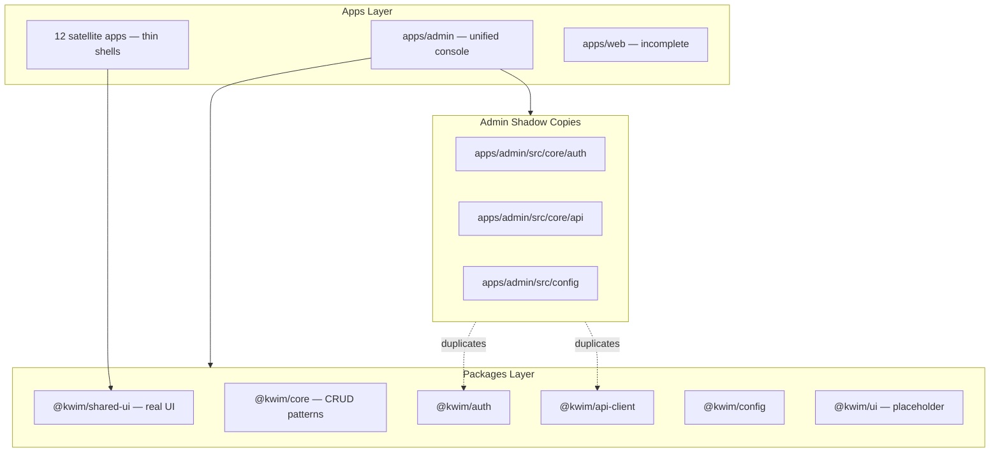
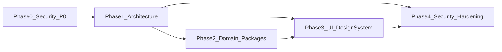

# Kwim Monorepo — Production Hardening Plan

This plan unifies all three prompt frameworks against the actual monorepo structure documented in [`structure_monorepo.md`](d:\app\kwim-app\structure_monorepo.md). **No business behavior changes** in architecture refactors; security fixes are the exception where current behavior is actively unsafe.

---

## Current State (Assessment)



| Area | Status | Key risk |
|------|--------|----------|
| **UI** | Mid-migration: shadcn in `shared-ui`, MUI legacy in admin, ~150 duplicated nav files | Inconsistent UX, no shared empty/error states |
| **Architecture** | Admin module registry is correct; packages exist but admin shadows them | Config alias drift, dual HR/transport implementations |
| **Security** | Hardcoded creds, guest super-admin bypass, tokens in localStorage | Critical exposure in production bundles |

---

## Phase 0 — Security P0 (Week 1)

*Prompt 3.md deliverables: executive summary, vulnerability remediation, secure implementation*

### 0.1 Remove hardcoded credentials

**Files:** [`apps/admin/src/core/auth/login/Login.tsx`](d:\app\kwim-app\apps\admin\src\core\auth\login\Login.tsx), [`apps/web/src/features/auth/Login.tsx`](d:\app\kwim-app\apps\web\src\features\auth\Login.tsx)

- Change `initialValues` to empty `username` / `password`
- Rotate `kwim274651` password on backend (out of repo)
- Add pre-commit secret scan (gitleaks or `pnpm audit` in CI)

### 0.2 Harden guest login

**Files:** [`packages/auth/src/guestAuth.ts`](d:\app\kwim-app\packages\auth\src\guestAuth.ts), both `Login.tsx` files

Default: **dev-only** (preserves your demo need without production risk):

```tsx
{import.meta.env.DEV && (
  <button type="button" onClick={handleGuestLogin}>Continuer en tant qu'invité</button>
)}
```

- Remove client-side `permissions: ["*"]` grant — rely on `SUPER_ROLES` injection in [`packages/auth/src/store/auth.store.ts`](d:\app\kwim-app\packages\auth\src\store\auth.store.ts) only after server-validated login
- Do not export `GUEST_CREDENTIALS` from public `@kwim/auth` index
- Backend must reject tokens ending in `.guest-signature` (document as API requirement)

### 0.3 Lock down diagnostic route

**Files:** [`apps/admin/src/app/Router.tsx`](d:\app\kwim-app\apps\admin\src\app\Router.tsx), [`apps/admin/src/pages/DiagnosticPage.tsx`](d:\app\kwim-app\apps\admin\src\pages\DiagnosticPage.tsx)

- Wrap `/diagnostic` in `import.meta.env.DEV` guard or `ProtectedRoute` + super-admin role
- Never render raw `access_token` / `refresh_token` values

### 0.4 Secrets hygiene

**Files:** [`.gitignore`](d:\app\kwim-app\.gitignore), map components under `apps/admin/src/modules/transport/` and `components/utilitie/map/`

- Uncomment `.env` in `.gitignore`; add `.env.example` with `VITE_MAPBOX_TOKEN`, `VITE_GOOGLE_MAPS_KEY`
- Replace hardcoded Mapbox/Google keys with `import.meta.env.VITE_*`
- Rotate exposed keys in provider dashboards

### Security risk matrix (Phase 0 targets)

| Finding | Severity | Phase 0 action |
|---------|----------|----------------|
| Hardcoded login credentials | Critical | Remove + rotate |
| Guest super-admin bypass | Critical | DEV-only gate |
| `/diagnostic` exposes localStorage | High | DEV-only or auth-gated |
| Hardcoded map API keys | High | Env vars + rotate |
| Tokens in localStorage | High | Document; migrate in Phase 2 |

---

## Phase 1 — Architecture Consolidation (Weeks 2–3)

*Prompt 2.md deliverables: proposed architecture, folder structure, module responsibilities, migration strategy*

### 1.1 Single source of truth for infrastructure packages

**Goal:** Eliminate shadow copies in `apps/admin/src/core/`.

| Duplicate (delete/re-export) | Canonical package |
|------------------------------|-------------------|
| [`apps/admin/src/core/auth/auth.store.ts`](d:\app\kwim-app\apps\admin\src\core\auth\auth.store.ts) | [`packages/auth`](d:\app\kwim-app\packages\auth) |
| [`apps/admin/src/core/api/apiClient.ts`](d:\app\kwim-app\apps\admin\src\core\api\apiClient.ts) | [`packages/api-client`](d:\app\kwim-app\packages\api-client) |
| [`apps/admin/src/config/index.ts`](d:\app\kwim-app\apps\admin\src\config\index.ts) | [`packages/config`](d:\app\kwim-app\packages\config) |

**Fix config alias drift** in [`apps/admin/tsconfig.json`](d:\app\kwim-app\apps\admin\tsconfig.json) — align `"@/config"` with Vite alias (`@kwim/config`), delete local config copy.

**Target `apps/admin/src/core/auth/index.ts`:**

```ts
export { useAuthStore, useAuth, Can, ProtectedRoute } from '@kwim/auth';
export type { User } from '@kwim/auth';
// Login pages stay in admin (presentation)
```

### 1.2 Enforce dependency direction

```
apps → packages/modules → packages/{core,shared-ui,auth,api-client,config}
packages/{auth,api-client,config} → packages/utils only (no React UI)
@kwim/core → @kwim/shared-ui
@kwim/shared-ui → must NOT import @kwim/core or domain packages
```

Add ESLint `no-restricted-imports` in root to block `apps/*/src/**` from importing sibling apps.

### 1.3 Consolidate ModuleShell (3 copies today)

Pick one: [`packages/core/src/ui/ModuleShell.tsx`](d:\app\kwim-app\packages\core\src\ui\ModuleShell.tsx)

- Inject breadcrumb updates via callback prop instead of Redux in admin copy
- Delete [`apps/admin/src/core/ui/ModuleShell.tsx`](d:\app\kwim-app\apps\admin\src\core\ui\ModuleShell.tsx) and [`packages/shared-ui/src/layout/ModuleShell.tsx`](d:\app\kwim-app\packages\shared-ui\src\layout\ModuleShell.tsx) duplicates

### 1.4 Unify HTTP layer

- Ban raw `axios` in modules — route all calls through `@kwim/api-client`
- Fix refresh URL inconsistency in [`apps/admin/src/utils/api.ts`](d:\app\kwim-app\apps\admin\src\utils\api.ts) (wrong `/api/auth/refresh` path)
- Add refresh mutex in [`packages/api-client/src/apiClient.ts`](d:\app\kwim-app\packages\api-client\src\apiClient.ts) to prevent parallel 401 storms

### 1.5 Satellite app deduplication

**Delete ~150 thin wrappers** in `apps/*/src/components/{sidebar,navbar}/` — use `AppLayout` from `@kwim/shared-ui` directly with router adapter:

```tsx
// apps/hr/src/App.tsx — target pattern
import { AppLayout } from '@kwim/shared-ui';
import { hrModuleConfig } from '@kwim/shared-ui/configs/hr.menu';
```

Wire real auth from `@kwim/auth` (replace hardcoded mock users in satellite `App.tsx` files).

### Proposed target folder structure

```
packages/
├── config/           # API_CONFIG, FEATURES, env
├── auth/             # store, guards, guestAuth (dev-only)
├── api-client/       # axios + service clients + generated hooks
├── core/             # CrudPage, Page*, QueryState, ModuleShell
├── shared-ui/        # shadcn primitives, AppLayout, menus (merge ui/ here)
├── utils/
└── modules/          # Phase 2 — domain bounded contexts
    └── hr/           # schemas, api, pages, shell

apps/
├── admin/            # registerModules, Router, landing only
├── web/              # public auth + landing
└── {hr,...}/         # thin dev shells OR deprecated
```

---

## Phase 2 — Domain Package Extraction (Weeks 4–6)

*Prompt 2.md: DDD bounded contexts, reduce coupling*

**Pilot domain: HR** (most complete in both [`apps/admin/src/modules/hr/`](d:\app\kwim-app\apps\admin\src\modules\hr) and [`apps/hr/`](d:\app\kwim-app\apps\hr))

```
packages/modules/hr/
├── domain/       # employee.schema.ts, permission constants
├── application/  # hr.api.ts, query keys
├── presentation/ # EmployeePage, HrShell, routes
└── index.ts      # export hrModule: FrontModule
```

- Admin [`registerModules.ts`](d:\app\kwim-app\apps\admin\src\app\registerModules.ts): `import { hrModule } from '@kwim/modules-hr'`
- Delete duplicate `EmployeePage.tsx` from whichever location is subsumed
- Repeat for transport, finance, inventory, etc.

**Menu single source:** [`packages/shared-ui/src/configs/*.menu.ts`](d:\app\kwim-app\packages\shared-ui\src\configs) — admin `FrontModule.menu` imports from there.

---

## Phase 3 — Production UI Design System (Weeks 5–8)

*Prompt 1.md deliverables: component architecture, props/API, loading/empty/error states, accessibility*

### 3.1 Merge `@kwim/ui` into `@kwim/shared-ui`

Delete placeholder [`packages/ui`](d:\app\kwim-app\packages\ui); rename exports to `@kwim/ui` alias pointing at `shared-ui` for backward compatibility.

### 3.2 Add shared feedback primitives

New components in `packages/shared-ui/src/components/feedback/`:

| Component | Purpose | WCAG notes |
|-----------|---------|------------|
| `Loading` | Unified spinner (replace PacmanLoader, ClipLoader) | `role="status"`, `aria-live="polite"` |
| `Skeleton` | shadcn skeleton for tables/cards | `aria-busy="true"` |
| `EmptyState` | Icon + title + description + action | Semantic heading, focusable CTA |
| `ErrorState` | Error panel with retry | `role="alert"` |
| `QueryState` | `{ isLoading, error, isEmpty, children }` wrapper | Composes above |

**Wire into existing CRUD:**

- [`packages/core/src/crud/CrudTable.tsx`](d:\app\kwim-app\packages\core\src\crud\CrudTable.tsx) — replace red `"No data found"` with `<EmptyState>`
- [`packages/core/src/crud/CrudPage.tsx`](d:\app\kwim-app\packages\core\src\crud\CrudPage.tsx) — use `<ErrorState onRetry={refetch}>`
- Move [`apps/admin/src/components/utilities/ErrorBanner.tsx`](d:\app\kwim-app\apps\admin\src\components\utilities\ErrorBanner.tsx) into shared-ui

### 3.3 Design tokens + Tailwind preset

Create `packages/shared-ui/tailwind.preset.js` with shadcn HSL tokens from [`apps/admin/src/styles/shadcn.css`](d:\app\kwim-app\apps\admin\src\styles\shadcn.css).

Update all app `tailwind.config.js` files to:

```js
presets: [require('@kwim/shared-ui/tailwind.preset')],
content: ['../../packages/shared-ui/src/**/*', './src/**/*'],
```

### 3.4 Standard page composition (target pattern)

```tsx
<Page>
  <PageHeader title="Warehouses" actions={<Can permission="warehouse.create"><Button>Add</Button></Can>} />
  <PageToolbar search={search} onSearchChange={setSearch} />
  <PageContent>
    <QueryState isLoading={isLoading} error={error} isEmpty={!data?.length} onRetry={refetch}
      emptyTitle="No warehouses yet" emptyAction={<Button>Create</Button>}>
      <CrudTable columns={cols} data={data} />
    </QueryState>
  </PageContent>
</Page>
```

### 3.5 Legacy UI retirement

- Migrate `ReusableDataTable` / `ReusableDataTableRole` → `CrudTable`
- Retire MUI from tables; keep only where maps/charts require it until replaced
- Consolidate 3 `PlaceholderPage` variants into one `EmptyState` variant

### 3.6 Developer experience

- Add Storybook to `packages/shared-ui` for component catalog
- Document props/API in each component file (JSDoc)
- Add `aria-*` audit pass on form components in `components/ui/`

---

## Phase 4 — Security Hardening (Ongoing, Weeks 6–10)

*Prompt 3.md: production-grade mitigations*

| Item | Action | Files |
|------|--------|-------|
| Token storage | Migrate to httpOnly Secure SameSite cookies (backend + auth store) | `@kwim/auth`, backend API |
| Client RBAC | Document as UX-only; add `/auth/me` post-login for authoritative permissions | `Login.tsx`, backend |
| Tenant spoofing | Derive tenant from JWT, not `localStorage.tenant_id` | `axios-instance.ts`, `subdomain.ts` |
| CI/CD security | Add `.github/workflows/security.yml`: `pnpm audit`, gitleaks, type-check, lint | repo root |
| CSP | Add Content-Security-Policy at CDN/reverse-proxy | infra |
| `.env` | `.env.example` only in git; CI secrets for prod builds | root |

---

## Execution Order & Dependencies



---

## Deliverables Checklist (mapped to prompts)

### Prompt 1 — Frontend Engineer
- Component architecture diagram (Phase 3)
- Folder structure for `@kwim/shared-ui` feedback + layout
- Props/API for `QueryState`, `EmptyState`, `ErrorState`
- Loading/empty/error wired through `CrudPage`
- WCAG: `role="alert"`, `aria-live`, semantic headings
- Usage examples in Storybook

### Prompt 2 — Software Architect
- Current assessment (above)
- Design problems with file paths (documented per phase)
- Proposed package boundaries + dependency rules
- Migration strategy: Phase 0→4, HR pilot first
- No business behavior changes in refactors

### Prompt 3 — Security Engineer
- Executive summary + risk matrix (Phase 0 table)
- Detailed findings with severity (Phases 0 + 4)
- Attack scenarios: credential extraction, localStorage tampering, guest bypass
- Mitigation strategies per finding
- Security checklist: secrets, auth, CI, CSP

---

## First PR (immediate, ~1 day)

Smallest high-impact slice to start implementation:

1. Remove hardcoded credentials from both `Login.tsx`
2. Gate guest button behind `import.meta.env.DEV`
3. Gate `/diagnostic` behind DEV
4. Fix `.gitignore` for `.env`
5. Align `apps/admin/tsconfig.json` `@/config` → `@kwim/config`

This unblocks safe commits while Phase 1 architecture work proceeds in parallel.
