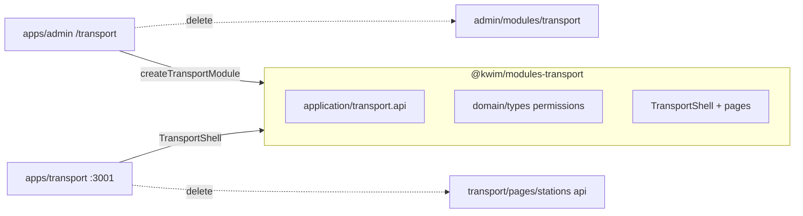

# Transport full migration to `@kwim/modules-transport`

## Goal

Single source of truth for transport UI (drivers, stations, schedules, reservations, vehicles, trips, seats, tickets, maps). Admin keeps `/transport` via a thin shim (like HR’s `createHrModule` pattern). Satellite [`apps/transport`](apps/transport) consumes the same package. Delete [`apps/admin/src/modules/transport`](apps/admin/src/modules/transport) entirely.



## Current state

| Location | What exists |
|----------|-------------|
| [`apps/admin/src/modules/transport`](apps/admin/src/modules/transport) | **40 files** — full module (`TransportShell`, driver, gare, horaires, reservation, seat, ticket, trip, maps) |
| [`apps/transport`](apps/transport) | Shell + **stations CRUD only** (7 placeholders) |
| [`packages/core` `createListPage`](packages/core/src/crud/createModule.tsx) | **Stub returns `null`** — vehicles/trips/seats/tickets tabs in admin are broken today |

Admin-only dependencies used by transport: map components under [`apps/admin/src/components`](apps/admin/src/components) (`cartoTrip/`, `utilitie/map/`, `ReusableDialogSteps*`), [`apps/admin/src/routes/horaire`](apps/admin/src/routes/horaire), redux breadcrumb in `Horaire.tsx`, broken nav targets (`/administration/map-detail`, `/administration/detaillDrive/:id`).

## Target package layout

Create [`packages/modules-transport`](packages/modules-transport) mirroring [`packages/modules-hr`](packages/modules-hr):

```
packages/modules-transport/src/
  index.ts
  domain/
    permissions.ts          # driver.*, station.*, vehicle.*, ...
    station.types.ts        # from gare/station.types.ts
    transport.constants.ts  # SEXES, JOURS, seat enums (from admin @/types/constants)
  application/
    transport.api.ts        # driverApi + stationApi + list helpers for all entities
  presentation/
    createTransportModule.tsx   # FrontModule factory for admin
    TransportShell.tsx          # ModuleShell + 8 nav items (moved from admin)
    components/
      maps/                     # MapComponent, MapDetailStation, MapHoraire, MapTrip, ...
      dialogs/                  # ReusableDialogSteps, ReusableDialogStepsEdit
    pages/
      drivers/                  # DriverListPage, AddDriver, EditDriver, ViewDriver
      stations/                 # Gare, AddGare, EditStation, GareMap, useStationMapForm
      horaires/                 # Horaire, AddHoraire
      reservations/             # Reservation + 3 tab flows
      vehicles/                 # CrudPage list (replaces broken createListPage)
      trips/
      seats/                    # CrudPage + AddSeat/EditSeat where needed
      tickets/
      tripsCarto/               # TripCarto (optional tab or dev page)
```

**Import rule:** package code uses `@kwim/shared-ui`, `@kwim/core`, `@kwim/api-client`, `@kwim/config` only — no `@/` admin paths.

## Phase 1 — Scaffold package

- Add [`packages/modules-transport/package.json`](packages/modules-transport/package.json) with deps: `@kwim/core`, `@kwim/shared-ui`, `@kwim/api-client`, `@kwim/config`, `@tanstack/react-query`, `@tanstack/react-table`, `formik`, `yup`, `sweetalert2`, `react-spinners`, `axios`, `mapbox-gl`, `@react-google-maps/api`, `lucide-react`.
- Add `tsconfig.json` + `type-check` script (same pattern as modules-hr).
- Register workspace in root `pnpm-workspace.yaml` if needed.

## Phase 2 — Move domain + API

- Merge [`apps/admin/src/modules/transport/api/transport.api.ts`](apps/admin/src/modules/transport/api/transport.api.ts) with satellite [`apps/transport/src/api/transport.api.ts`](apps/transport/src/api/transport.api.ts) into package `application/transport.api.ts`.
- Use `API_CONFIG.transport.baseUrl` (not deprecated `API_ROUTE`).
- Add `driverApi` + CRUD helpers for `/vehicle`, `/trip`, `/seat`, `/ticket`, schedule endpoints used by horaires.
- Move `station.types.ts` + `STATION_COMPANY_ID` to `domain/`.

## Phase 3 — Move presentation (bulk port)

Move files from admin transport module into package `presentation/pages/*`, fixing imports:

| Admin source | Package destination | Notes |
|--------------|---------------------|-------|
| `driver/` | `pages/drivers/` | Replace `/administration/detaillDrive/:id` with `/transport/drivers/:id` or in-shell view |
| `gare/` | `pages/stations/` | **Replace** satellite `pages/stations/*` (single implementation) |
| `horaires/` | `pages/horaires/` | Remove redux `setBreadCrumbItemsAction`; use inline title or `ModuleShell` breadcrumb |
| `reservation/` | `pages/reservations/` | Port tab components |
| `TransportShell.tsx` | `presentation/TransportShell.tsx` | Wire package page components |

Move admin transport-only components into `presentation/components/`:

- [`apps/admin/src/components/others/cartoTrip/*`](apps/admin/src/components/others/cartoTrip)
- [`apps/admin/src/components/utilitie/map/*`](apps/admin/src/components/utilitie/map) (station/trip/horaire maps)
- [`apps/admin/src/components/utilitie/ReusableDialogSteps*.tsx`](apps/admin/src/components/utilitie)

Replace `@/components/ui/*` with `@kwim/shared-ui`. Replace `@/core/crud` with `@kwim/core`.

## Phase 4 — Fix broken list pages (vehicles, trips, seats, tickets)

Do **not** rely on [`createListPage`](packages/core/src/crud/createModule.tsx) stub. Implement real pages in the package using `CrudPage` + columns from current [`TransportShell.tsx`](apps/admin/src/modules/transport/TransportShell.tsx) (lines 16–109):

- `VehiclesPage`, `TripsPage`, `SeatsPage`, `TicketsPage` — each with `queryFn`/`deleteFn` from `transport.api.ts` and tokenized status cells (`text-muted-foreground`, semantic badges).

Port custom seat/ticket add-edit dialogs from [`seat/`](apps/admin/src/modules/transport/seat) and [`ticket/`](apps/admin/src/modules/transport/ticket) where they add value beyond generic CRUD.

## Phase 5 — Maps and routes

- Add `GareMap` as stations sub-route or shell tab (`stations-map` key).
- Fix internal navigation:
  - `Gare.tsx` map button: `/administration/map-detail` → in-app stations map view
  - `DriverListPage` view: `/administration/detaillDrive/:id` → `ViewDriver` dialog or `/transport/drivers/:id` if admin embeds nested route
- Delete orphan stubs: empty `ViewGare.tsx`, `ViewSeats.tsx` unless implemented.
- Inline horaire breadcrumb config from [`apps/admin/src/routes/horaire/horaireRoutes.tsx`](apps/admin/src/routes/horaire/horaireRoutes.tsx) into `Horaire.tsx`; delete `horaireRoutes.tsx` if unused elsewhere.

## Phase 6 — Wire consumers

### Admin (embedded `/transport`)

Replace entire [`apps/admin/src/modules/transport`](apps/admin/src/modules/transport) folder with a thin shim like HR:

```tsx
// apps/admin/src/modules/transport/index.tsx
import { createTransportModule } from "@kwim/modules-transport";
import PageTitle from "@/components/utilitie/PageTitle";

export const transportModule = createTransportModule({ PageTitle });
export { stationApi, driverApi, TRANSPORT_PERMISSIONS } from "@kwim/modules-transport";
```

- [`registerModules.ts`](apps/admin/src/app/registerModules.ts) — keep `transportModule` import (path unchanged).
- Add `@kwim/modules-transport` to [`apps/admin/package.json`](apps/admin/package.json), [`vite.config.ts`](apps/admin/vite.config.ts), [`tsconfig.app.json`](apps/admin/tsconfig.app.json).
- [`AppShell.tsx`](apps/admin/src/app/AppShell.tsx) — update/remove `/administration/map-detail` special-case if route moves under `/transport`.
- Keep mapbox CSS in [`apps/admin/src/index.css`](apps/admin/src/index.css) (embedded transport still renders maps).

### Satellite [`apps/transport`](apps/transport)

Slim app to shell only:

```tsx
// App.tsx — use TransportShell from package instead of local pageComponents map
import { TransportShell } from "@kwim/modules-transport";
```

- Remove duplicate [`src/pages/stations/*`](apps/transport/src/pages/stations), [`src/api/transport.api.ts`](apps/transport/src/api/transport.api.ts).
- Keep `Dashboard` + `PlaceholderPage` re-exports only if `TransportShell` does not include dashboard; otherwise use package dashboard or shared `ModuleDashboard`.
- Add `@kwim/modules-transport` dep; add mapbox/google-maps peer deps + CSS import in [`index.css`](apps/transport/src/index.css).
- Align [`module.config.ts`](apps/transport/src/config/module.config.ts) with shared menu or remove stale config.

## Phase 7 — Delete admin transport tree + cleanup

- Delete **`apps/admin/src/modules/transport/**`** (all subfolders after package verified).
- Remove admin components **only if** no other module imports them (verify with grep before deleting `cartoTrip`, `utilitie/map`, `ReusableDialogSteps`).
- Update [`platformData.ts`](apps/admin/src/modules/admin-area/platformData.ts) quick action `path: "/transport"` — unchanged (still embedded).
- Regenerate or update [`apps/transport/transport.md`](apps/transport/transport.md) to reflect new structure.

## Phase 8 — Verify

- `pnpm --filter @kwim/modules-transport type-check`
- `pnpm --filter @kwim/transport type-check`
- `pnpm --filter @kwim/admin type-check`
- Manual smoke: admin `/transport` all 8 tabs; satellite `:3001` same tabs; light/dark; station map form; driver CRUD; reservation tabs.

## Bus / taxi / transport modes

Not separate apps — `transportMode` on vehicles/trips remains a **column/filter** on list pages (default `"bus"`). No new top-level menu split in this migration; can add mode filter later in package list pages.

## Risk notes

- **Large diff** (~40+ files moved) — do in ordered phases with type-check after each.
- **Map API keys** — ensure `MAP_KEYS` / `VITE_*` env vars work in both apps via `@kwim/config`.
- **Legacy pages** (`Driver.tsx`, `Seat.tsx`, `Ticket.tsx`) — skip port if superseded by `CrudPage`; delete with admin folder.
